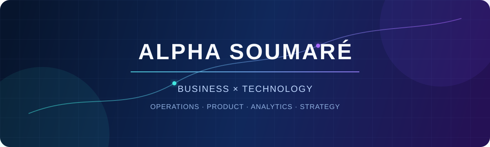
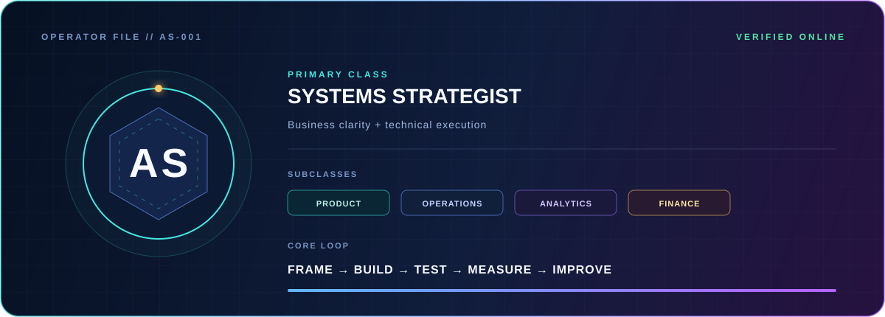
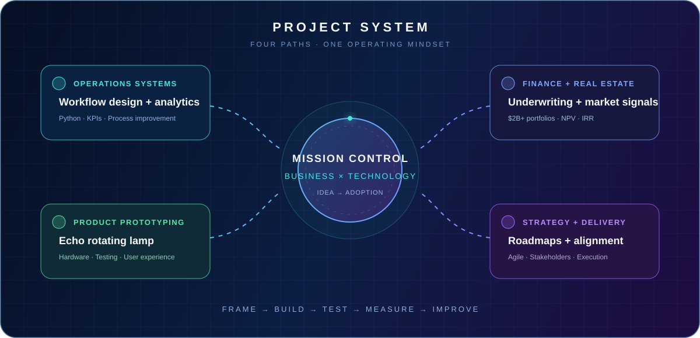

  

  
  
  
  

<code>RPG INTERFACE // REAL-WORLD RESULTS // PLAYER ONE: ALPHA</code>

  I turn ambiguous business problems into practical systems, measurable decisions, and products people can actually use.

  <strong>Technology Consulting · Product · Operations · Analytics · FinTech</strong>

---

## 🎮 Player profile

  

I'm **Alpha Soumaré**, a Business and Technology Management student at NYU Tandon. My build combines strategy, product thinking, analytics, finance, prototyping, and execution.

I like the hard middle of a project: translating between people and technology, turning scattered information into a clear plan, and staying close enough to delivery to prove the idea works.

## 🏆 Achievement unlocks

| **68%** | **14 → 5 days** | **$2B+** | **100+ vehicles** | **30+ students** |
| :---: | :---: | :---: | :---: | :---: |
| Screening time reduced | Time-to-hire improved | CRE portfolios analyzed | Fleet-tech rollout supported | Program alignment |

> **Build philosophy:** Every number above connects to real work. The interface is a game. The outcomes are not.

## 🗺️ Active quest board

| Quest | Objective | Loadout |
| --- | --- | --- |
| **[01 // Delivery Operations Analytics](./delivery-ops-analytics)** | Turn synthetic delivery records into reliability, cost, productivity, and regional KPIs, then connect the findings to operating decisions. | `Python` `Pandas` `Pytest` |
| **[02 // CRE Underwriting Model](./cre-underwriting-model)** | Evaluate a fictional commercial real estate acquisition through NOI, debt service, DSCR, cash-on-cash return, NPV, IRR, and exit value. | `Python` `Finance` `JSON` |
| **[03 // Echo Rotating Lamp](./business-technology-case-studies/case-studies/echo-rotating-lamp.md)** | Lead delivery and testing for a working prototype that rotates, responds to sound, and was presented to NYU faculty and advisors. | `Prototyping` `Electronics` `Testing` |
| **[04 // Business Technology Case Files](./business-technology-case-studies)** | Show how I frame problems, align stakeholders, build operating systems, and connect technology decisions to measurable outcomes. | `Strategy` `Agile` `Operations` |

  

## 🏰 Faction history

| Chapter | Role in the campaign |
| --- | --- |
| **NYU VIP Tech Catalyst** | Technology evaluation, agile sprint planning, and roadmap alignment across 30+ students |
| **NYU Undergraduate Teaching Assistant** | Supports 100+ students working with C++, Java, Fusion 360, and engineering design |
| **Same Day Delivery, Strategy & Operations** | Built recruiting and fleet workflows that improved speed, visibility, and dispatch performance |
| **BGO AI Commercial Real Estate Fellow** | Analyzed $2B+ in portfolios and compared investment signals across 10+ U.S. markets |
| **NSBE Finance Chair** | Manages a $12K+ budget and strengthens financial visibility for chapter programs |

## ⚔️ Skill inventory

  
  
  
  
  
  

  
  
  
  
  
  

## 🧬 Core ability

  <code>FRAME</code> → <code>BUILD</code> → <code>TEST</code> → <code>MEASURE</code> → <code>IMPROVE</code>

My edge is not one tool. It is the ability to move between the business question, the technical build, the operating reality, and the measurable result.

## 🔮 Next campaign

I'm exploring **2027 opportunities** across technology consulting, strategy, product, operations, and financial technology.

  <a href="https://www.linkedin.com/in/alpha-soumare-381910332"><strong>⚡ OPEN LINKEDIN CHANNEL ⚡</strong></a>

<code>ALPHA.OS // QUEST LOG ACTIVE // SYSTEM ONLINE</code>

